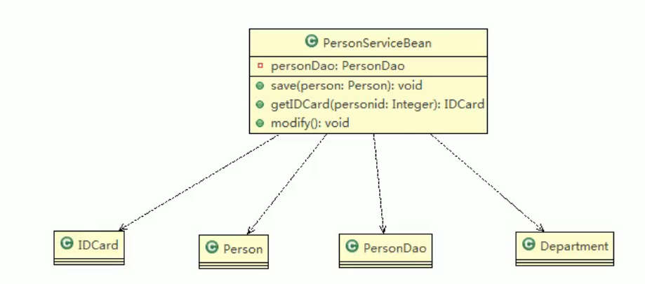
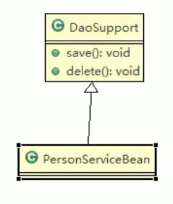
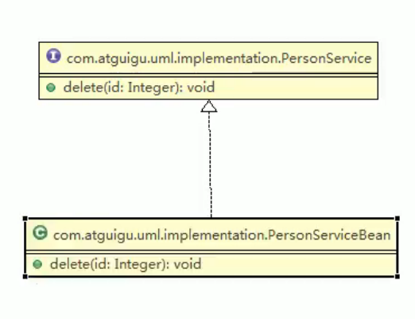
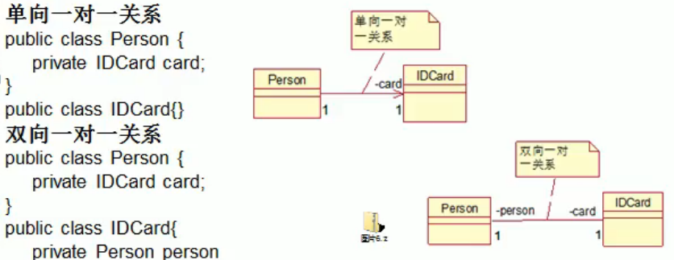
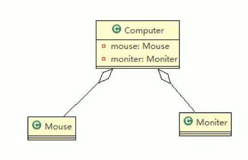
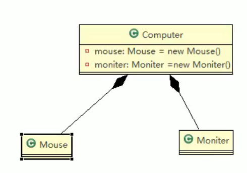

# 设计模式

# 七大原则

设计模式遵守的七大原则：

1. 单一职责原则
2. 接口隔离原则
3. 依赖倒转原则
4. 里氏替换原则
5. 开闭原则ocp
6. 迪米特法则
7. 合成复用原则

设计原则的核心思想是：

1. 找出应用中可能需要变化之处，把它们独立出来，不要和那些不需要变化的代码混在一起。
2. 针对接口编程，而不是针对实现编程。
3. 为了交互对象之间的松耦合设计而努力。

## 单一职责原则

对类来说，一个类应该只负责一项职责。

单一职责原则注意事项和细节：

1. 降低类的复杂度，一个类只负责一项职责。

2. 提高类的可读性，可维护性。

3. 降低变更引起的风险。

   

## 接口隔离原则

客户端不应该依赖它不需要的接口，即一个类对另一个类的依赖应该建立在最小的接口上。

## 依赖倒转原则

1. 高层模块不应该依赖底层模块，两者都应该依赖其**抽象**
2. 抽象不应该依赖细节，细节应该依赖抽象
3. 依赖倒转的中心思想是面向接口编程
4. 依赖倒转的理念是：相对于细节的多变性，抽象的东西要稳定的多。
5. 使用接口或抽象类的目的是制定好规范，而不涉及任何具体操作，把展现细节的任务交给他们的实现类去完成。

依赖传递的三种方式：

1. 通过接口传递
2. 通过构造方法传递
3. 通过setter方法

## 里氏替换原则

所有引用基类的地方必须能透明的使用其子类对象。在使用继承时，遵循里氏替换原则，在子类中尽量不要重写父类的方法。

里氏替换原则表明继承实际上让两个类耦合性增强了，在适当的情况下，可以通过**聚合**、**组合**、**依赖**来解决问题而不一定要通过重写父类。

## 开闭原则

一个软件实体如类，模块和函数应该对扩展开放，对修改关闭。

当软件需要改变时，尽量通过扩展软件实体的行为来实现变化，而不是通过修改已有的代码来实现变化。

## 迪米特法则

一个对象应该对其他对象保持最少的了解。

## 合成复用原则

尽量使用合成、聚合的方式，而不是使用继承。

继承的话两个类之间的耦合性太高。

# UML类图

类图是描述类与类之间静态关系的，是UML图中最核心的。

类之间的关系：依赖、泛化（继承）、实现、关联、聚合、组合。

## 依赖

只要是**类中用到了对方**，那么他们之间就存在依赖关系。如果没有对方，连编译都通过不了。

构成依赖关系：

1. 类中用到了对方
2. 类的成员属性
3. 方法的返回类型
4. 方法接受的参数类型
5. 方法中局部变量使用到

## 泛化（继承）

是**依赖关系的特例**。

其中DaoSupport是一个抽象类 PersonServiceBean继承它。

## 实现

A类实现B类，是**依赖关系的特例**。

## 关联

是依赖关系的特例。

关联具有导航性：即双向关系或单向关系

关系具有多重性：如“1”（表示有且仅有一个），“0...”表示0个或者多个，“0，1”表示0个或者一个，“n...m”表示n到m个都可以，“m...”表示至少m个。

## 聚合

表示整体和部分之间的关系，**整体和部分可以分开**。聚合关系是关联关系的特例，所以具有关联的导航性与多重性。

## 组合

**整体和部分是不可分的**。则升级为组合关系。

# 设计模式概述

设计模式分为三种类型，共23种：

1. 创建型模式：**单例模式**、建造者模式、**工厂模式**。
2. 结构型模式：适配器模式、桥接模式、**装饰模式**、组合模式、外观模式、享元模式、**代理模式**。
3. 行为型模式：模板方法模式、命令模式、访问者模式、迭代器模式、**观察者模式**、中介者模式、备忘录模式、解释器模式、状态模式、策略模式、责任链模式。

