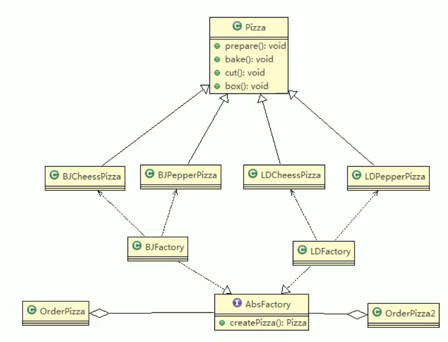

# 4.抽象工厂模式

基本介绍：

1. 定义一个interface用于创建相关或有依赖的对象簇，而无需指明具体的类。
2. 抽象工厂模式可以将**简单工厂模式**和**工厂方法模式**进行整合。
3. 从设计层面看，抽象工厂就是对简单工厂模式的改进（或者称为进一步的抽象）。
4. 将工厂抽象成两层，**抽象工厂**和具体实现的**工厂子类**。可以根据创建对象类型使用对应的工厂子类。这样将单个的简单工厂类变成了**工厂簇**，更利于代码的维护和扩展。

