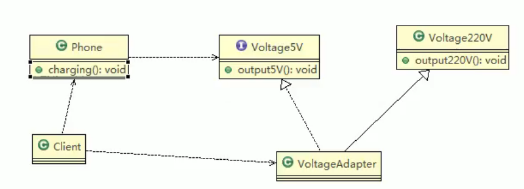
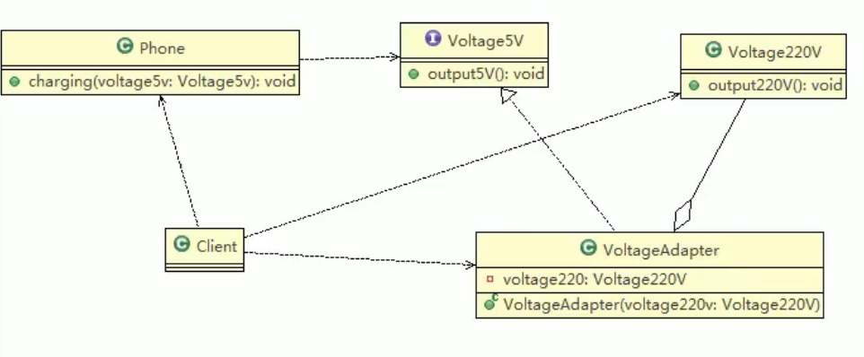
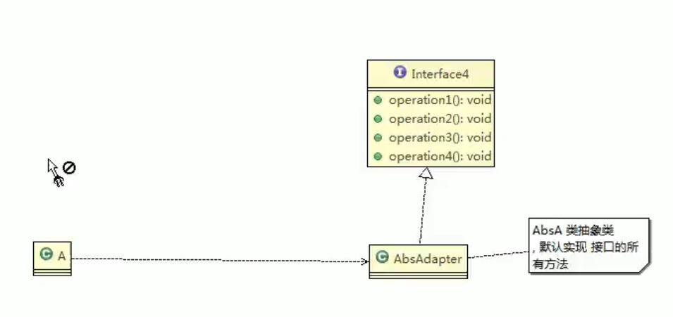
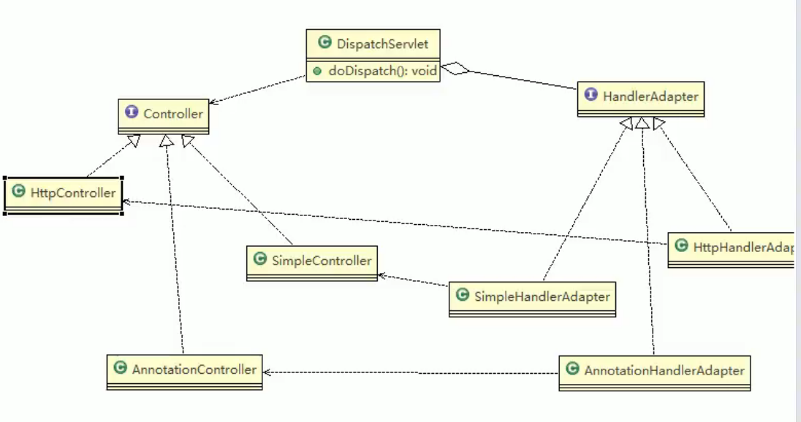

# 7.适配器模式

基本介绍：

1. 适配器模式将某个类的接口转换成客户端期望的另一个接口表示，主要目的是兼容性，让原本因接口不匹配不能一起工作的两个类可以协同工作，其别名为包装器（Wrapper）
2. 适配器模式属于**结构型模式**
3. 主要分为三类：类适配器模式、对象适配器模式、接口适配器模式

工作原理：

1. 将一个类的接口转换成另一种接口，让原本接口不兼容的类可以兼容。
2. 从用户角度看不到被适配者，是解耦的
3. 用户调用适配器转化出来的目标接口方法，适配器再调用被适配者的相关接口方法。
4. 用户收到反馈结果，感觉只是和目标接口交互。

## 类适配器

### 注意事项和细节

1. java是单继承机制，所以类适配器需要继承src类算是一个缺点，因为要求dst必须是接口，有一定的局限性。
2. src类的方法再Adapter中也会暴露出来，增加了使用的成本。
3. 由于继承了src类，所以它可以根据需求重写src类的方法，使得Adapter的灵活性增强了。

## 对象适配器

介绍：

1. 基本思路和类适配器模式相同，只是将Adapter类作修改，不是继承src类，而是持有src类的实例，以解决兼容性的问题。即：持有src类，实现dst类接口，完成src->dst的适配。
2. 根据合成复用原则，在系统中尽量使用关联关系来替代继承关系。
3. 对象适配器模式是适配器模式常用的一种。

## 接口适配器模式

1. 也叫缺省适配器模式。
2. 当不需要全部实现接口提供的方法时，可先设计一个抽象类实现接口，并为该接口中每个方法提供一个默认实现（空方法），那么该抽象类的子类可有选择地覆盖父类的某些方法来实现需求。
3. 适用于一个接口不想使用其所有的方法的情况。

# SpringMVC中的应用

1. Spring定义了一个适配接口，使得每一种Controller都有一种对应的适配器实现类。
2. 适配器代替controller执行相应的方法。
3. 扩展Controller时，只需要增加一个适配器类就完成了SpringMVC的扩展。

 