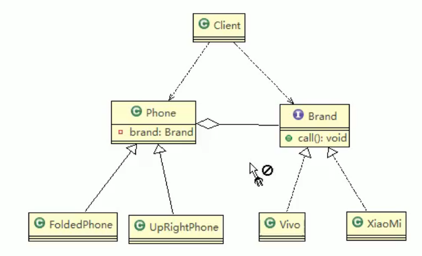

# 8.桥接模式

1. 桥接模式是指：将实现与抽象放在两个不同的类层次中，使得两个层次可以独立改变。解决了类爆炸问题。
2. 是一种结构型设计模式。
3. 桥接模式基于**类的最小设计原则**。通过封装、聚合及继承等行为让不用的类承担不同的职责。主要特点是把抽象与行为实现分离开来，从而可以保持各部分的独立性以及应对他们的功能扩展。

## 桥接模式在JDBC的使用

桥接模式在HDBC的使用：jdbc的Driver接口，如果从桥接模式来看，Driver就是一个接口，下面有MySQL的Driver,Oracle的Driver，这些就可以当做实现接口类。