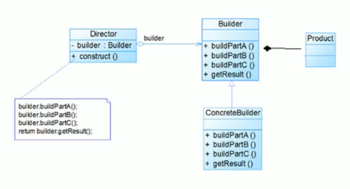
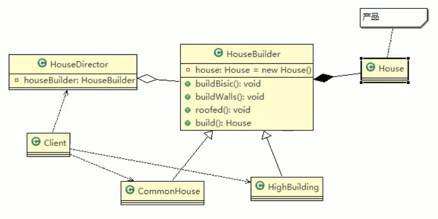

# 6.建造者模式

将产品与产品建造过程解耦=>建造者模式

基本介绍：

1. **建造者模式**又叫生成器模式，是一种对象构建模式。它可以将复杂对象的建造过程抽象出来（抽象类别），使这个抽象过程的不同实现方法可以构造出不同表现（属性）的对象。
2. **建造者模式**是一步一步创建一个复杂的对象，它允许用户只通过指定复杂对象的类型和内容就可以构建它们，用户不需要直到内部的具体构建细节。

建造者模式的四个角色：

1. **Product**，产品角色：一个具体的产品对象。
2. **Builder**，抽象建造者：创建一个Product对象的各个部件指定的接口|抽象类。指定一个建造的流程，建造的具体细节不管。
3. **ConcreteBuilder**，具体构建者：实现接口，构建和装配各个部件。
4. **Director**，指挥者：构建一个使用Builder接口的对象。主要是用于创建一个复杂的对象。主要有两个作用：一是隔离了客户与对象的生产过程，二是负责控制产品对象的生产过程。

## 在JDK中的应用

java.lang.StringBuilder中的建造者模式

