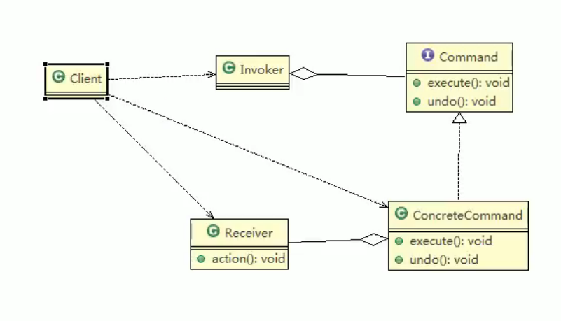
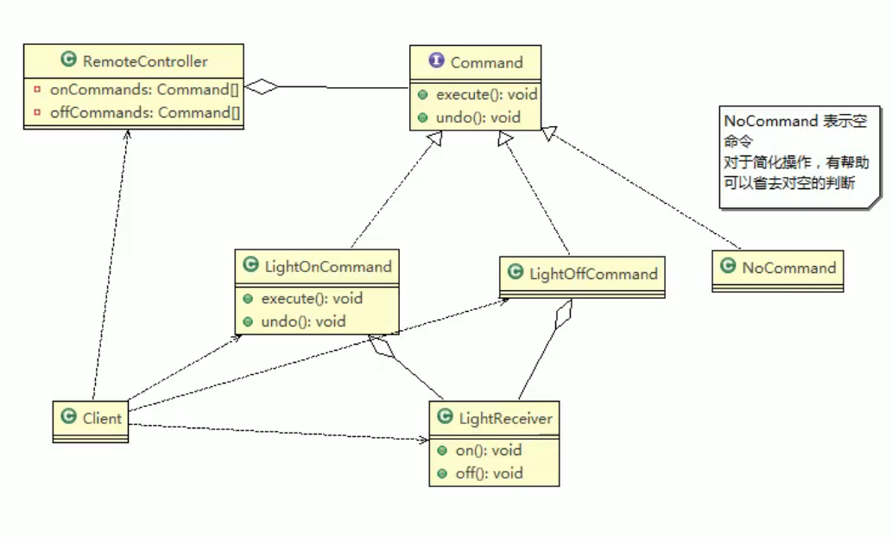

# 15.命令模式

命令模式使得请求发送者与请求接收者消除彼此之间的耦合，让对象之间的调用关系更加灵活，实现解耦。在命令模式中，会将一个请求封装成一个对象，以便使用不同参数来表示不同的请求（即命令），同时命令模式也支持可撤销的操作。

角色及职责：

1. Invoker 调用者角色
2. Command 命令角色 需要执行的所有命令都在这里，可以是接口或抽象类
3. Receiver 接受者角色 知道如何实施与执行一个请求相关的操作
4. ConcreteCommand 将一个接受者对象与一个动作绑定，调用接受者相应的操作，实现execute

## 命令模式在Spring中的使用

Spring框架JdbcTemplate就使用到了命令模式

## 注意事项和细节

容易设计一个命令队列，可以多线程执行命令

命令模式不足：可能导致有过多的具体命令，增加了系统复杂度。