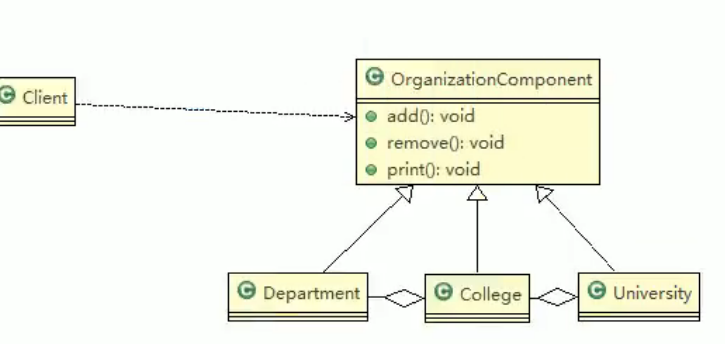

# 10.组合模式

基本介绍：

1. 组合模式，又叫部分整体模式，它创建了对象组的树形结构，将对象组合成树状结构以表示“整体-部分”的层次关系。
2. 组合模式依据**树形结构**来组合对象，用来表示部分以及整体层次。
3. 这种类型的设计模式属于结构型模式。
4. 组合模式使得用户对单个对象和组合对象的访问具有一致性，即：组合能让客户以一致的方式处理个别对象以及组合对象。

组成：

1. Component：这是组合中对象声明接口，在适当情况下，实现所有类共有的接口默认行为，用于访问和管理Comoment子部件，Component可以是**抽象类或接口**。
2. Leaf：在组合中表示叶子节点，叶子节点没有子节点
3. Composite：非叶子节点。用于存储子部件，在Component接口中实现子部件的相关操作，比如增加，删除。

解决的问题：

要处理的对象可以生成一颗树形结构，要对树上的节点和叶子进行操作时，能够提供一致的方式，而不用考虑它是节点还是叶子。

## 在JDK中的应用

Java的集合类-HashMap就用到了组合模式。

