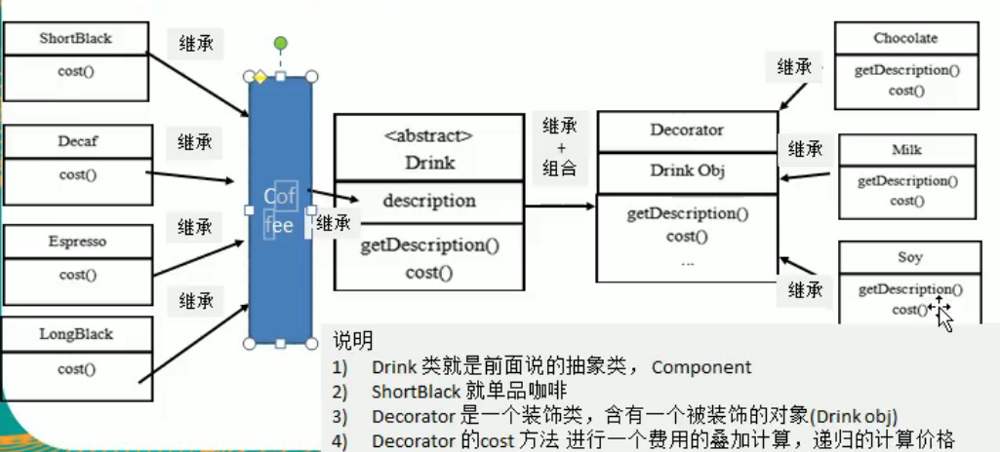
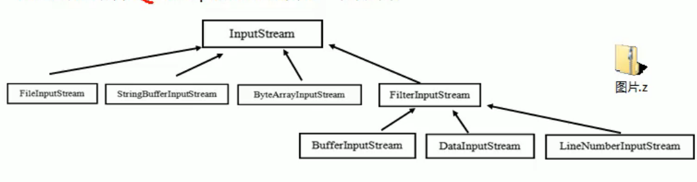

# 9.装饰者模式

定义：动态**的将新功能**附加到对象上。在对象功能扩展方面，比继承更有弹性，装饰者模式也体现了开闭原则。

原理：装饰者模式就像打包一个快递，主体（被装饰者），包装。

其中Decorator也是Drink类

## JDK中的应用

Java IO中，FilterInputStream就是一个装饰者

InputStream->Drink 抽象类

FileInputStream->单品咖啡

FilterInputStream->Decorator

BufferInputStream->调味品