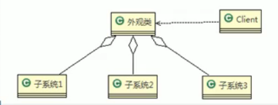
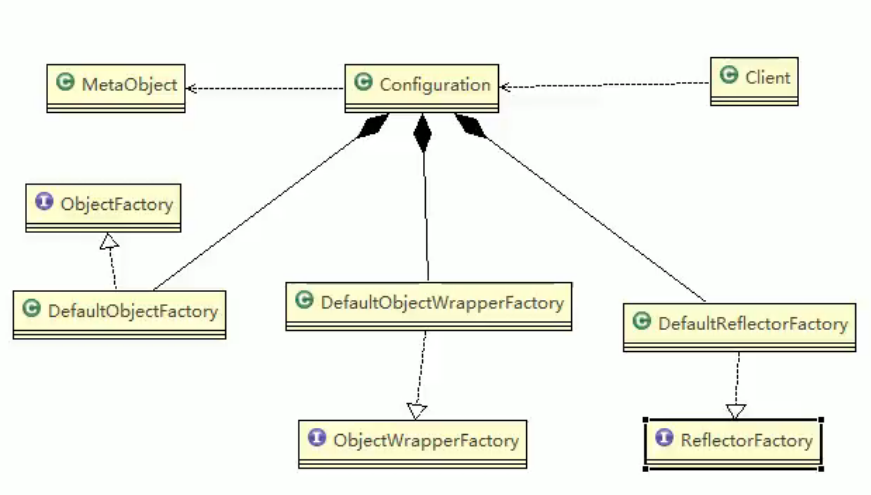

# 11.外观模式

外观模式（Facade），也叫过程模式：外观模式为子系统中的一组接口提供一个一致的界面，此模式定义了一个高层接口，这个接口使得这一子系统更加容易使用。外观模式通过定义一个一致的接口，用以屏蔽内部子系统的细节，使得调用端只需跟这个接口发生调用，而无需关心这个子系统的内部细节。

**外观模式就是解决多个复杂接口带来的使用困难，起到简化用户操作的作用。**

外观类：为调用端提供统一的调用接口，外观类知道哪些子系统负责处理请求，从而将调用端的请求代理给适当的子系统对象。

调用者：外观接口的调用者

子系统的集合：指模块或者子系统，处理Facade对象指派的任务，是功能的实际提供者。

## 在MyBatis框架应用

MyBatis中Configuration去创建MetaObject对象用到外观模式。

