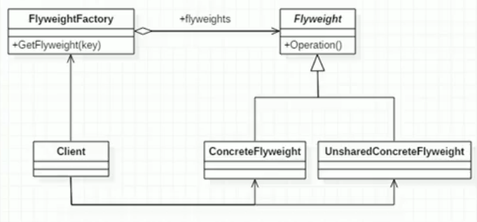
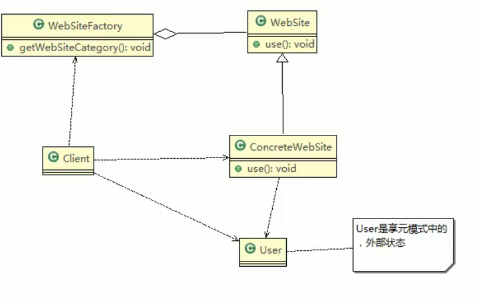

# 12.享元模式

享元模式，Flyweight Pattern也叫蝇量模式：运用共享技术有效地支持大量细粒度的对象。

常用于系统底层开发，解决系统的性能问题，比如**数据库连接池**，里面都是创建好的连接对象，在这些连接对象中有我们需要的则直接拿来用，避免重新创建，如果没有我们需要的，则创建一个。

享元模式能够解决**重复对象的内存浪费问题**，当洗头膏中有大量相似对象，需要缓冲池时。不需总是创建新对象，可以从缓冲池中拿。这样可以降低系统内存，同时提高效率。

享元模式**经典的应用场景**就是池技术，String常量池、数据库连接池、缓冲池等等都是享元模式的应用，享元模式时池技术的重要实现方式。

**FlyWeight**是抽象的享元角色，是产品的抽象类，同时定义出对象的**外部状态**和**内部状态**的接口或实现。

**ConcreteFlyWeight**是具体的享元角色，是具体的产品类，实现抽象角色定义相关业务。

**UnSharedConcreteFlyWeight**是不可共享的角色，一般不会出现在享元工厂。

**FlyWeightFactory**享元工厂类，用于构建一个池容器（集合），同时提供从池中获取对象方法。

五子棋的棋子对象，颜色就是**内部状态**，棋子的坐标就是**外部状态**。内部状态是指对象共享出来的信息，存储在享元对象内部且不会随环境的改变而改变。外部状态指对象得以依赖的一个标记，是随环境改变而改变的、不可共享的状态。

getegory是内部状态。

## JDK中的享元

Integer.valueOf

小结：

1. 在valueOf方法中，先判断是否在IntegerCache中，如果不在，就创建新的Integer(new)，否在，就从缓存池中取出

2. valueOf方法就使用到享元模式

3. valueOf在-128~127，就是使用享元模式返回。

   

