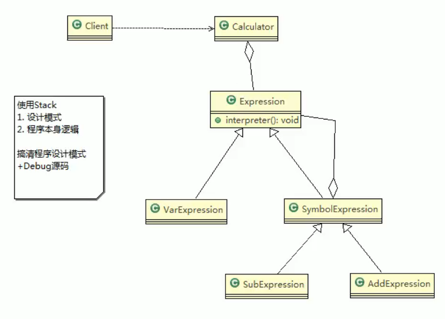

# 21.解释器模式

基本原理：

1. 解释器模式：是指给定一个语言（表达式），定义文法的一种表示，并定义一个解释器，使用该解释器来解释语言中的句子（表达式）
2. 应用场景，应用可以将一个需要解释执行的语言中的句子表示为一个抽象语法树，一些简单出现的问题可以用一种简单的语言来表达，一个简单语法需要解释的场景。

角色及职责：

1. Context：环境职责，含有解释器之外的全局信息。
2. AbstractExpression:抽象表达式，声明一个抽象的解释操作，这个方法为抽象语法树中所有的节点所共享。
3. TerminalExpression:为终结符表达式，实现与文法中的终结符相关的解释操作。
4. NonTermialExperssion:为非终结符表达式，为文法中的非终结符实现解释操作。
5. 说明：输入Context TerminalExpression信息通过Client输入即可。

## 注意事项和细节

1. 当有一个语言需要解释执行，可将该语言中的句子表示为一个抽象语法树，就可以考虑使用解释器模式，让程序具有良好的扩展性。
2. 应用场景：编译器、运算表达式计算、正则表达式、机器人。
3. 使用解释器可能带来的问题：解释器模式会引起类膨胀、解释器模式采用递归调用方法，将会导致调试非常复杂、效率可能降低。慎用，用以解决特定的问题使用。

