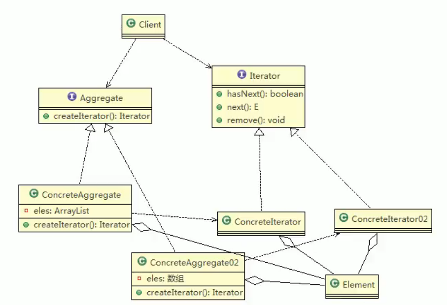
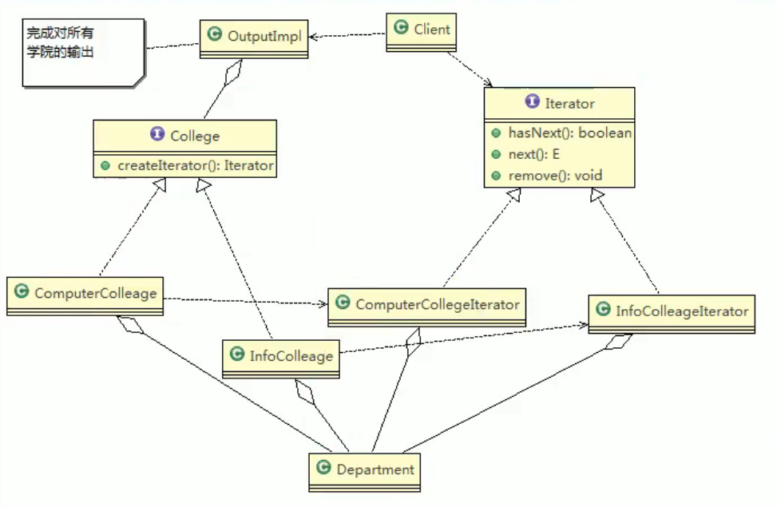
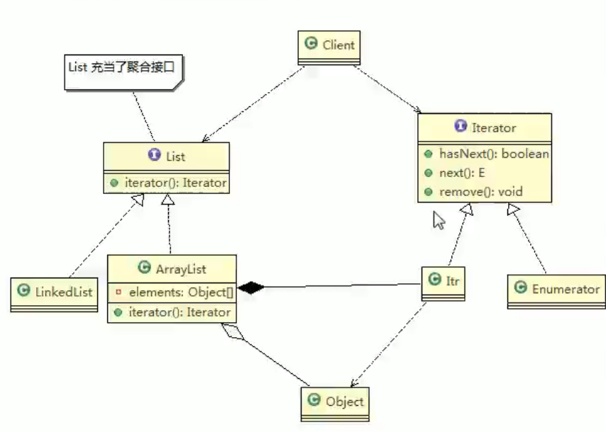

# 17.迭代器模式

基本介绍：

1. 属于行为型模式
2. 集合元素是不同的方式实现的，有数组、java集合类，当客户端要遍历这些集合元素时，就要使用多种遍历方式，而且还会暴露元素内部结构，可以使用迭代器模式解决。
3. 迭代器模式，提供一种遍历集合元素的统一接口，用一致的方法遍历集合元素，不需要知道集合对象的底层表示，即：不暴露其内部结构。迭代器模式解决了不同集合统一遍历问题。
4. 缺点：每个聚合对象都要一个迭代器，会生成多个迭代器不好管理类。

角色及职责：

1. Iterator:迭代器接口，是系统提供，含hasNext,next,remove
2. ConcreteIterator:具体的迭代类，管理迭代
3. Aggregate:一个统一的聚合接口，将客户端和具体聚合解耦
4. ConcreteAggreage:具体的聚合，持有对象集合。并提供一个方法，返回一个迭代器，该迭代器可以正确遍历集合
5. Client：客户端，通过Iterator和Aggregate依赖子类

## JDK ArrayList中的应用

