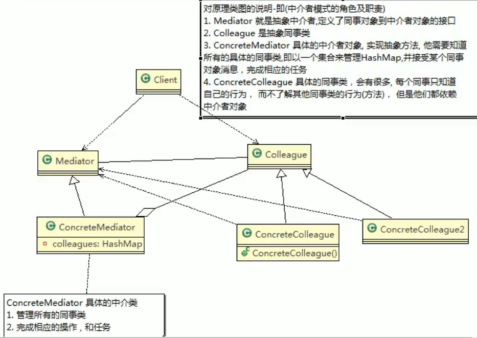
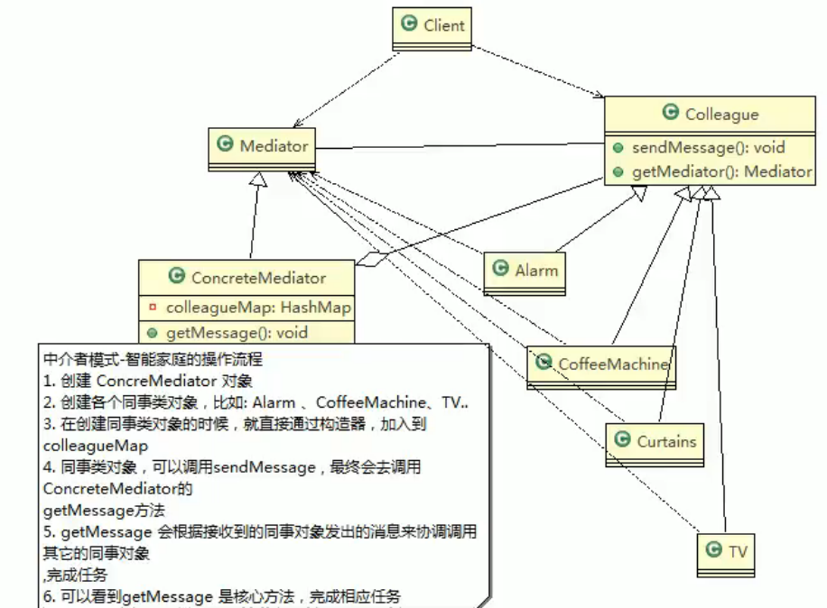

# 19.中介者模式

基本介绍：

1. 用中介对象来封装一系列的对象交互。中介者使各个对象不需要显式地相互引用，从而使其耦合松散，而且可以独立地改变他们之间的交互。
2. 中介者模式属于行为型模式，使代码易于维护。
3. MVC模式，C是M和V的中介者，在前后端交互时起到中间人的作用。

核心思想是设备与设备之间不进行交流，当增加新的设备时，只需修改getMessage()即可。

## 注意事项与细节

1. 多个类相互耦合，会形成网状结构，使用中介者模式将网状结构分离进行解耦。
2. 中介者承担了较多的责任，一旦中介者出现了问题，整个系统就会收到影响。
3. 如果设计不当，中介者对象本身变得过于复杂。