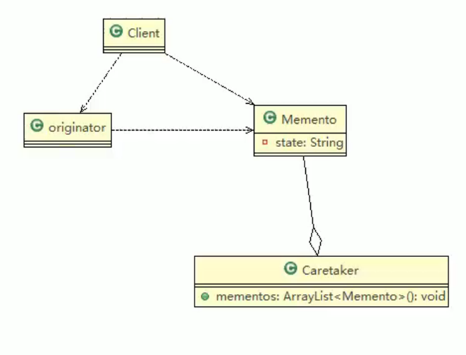

# 20.备忘录模式

基本介绍：

1. 备忘录模式指在不破坏封装性的前提下，捕获一个对象的内部状态，并在该对象之外保存这个状态。这样以后就可将该对象恢复到原先保存的状态。
2. 备忘录对象主要用来记录一个对象的某种状态，或者某些数据，当要回退时可以从备忘录对象里获取原理的数据进行恢复操作。
3. 备忘录模式属于行为型模式。

角色说明：

1. originator,对象，需要保存状态的对象。
2. memento,备忘录对象，负责保存好记录，即originator内部状态
3. caretaker:守护者对象，负责保存多个备忘录对象，使用集合管理，提高效率
4. 说明：如果希望保存多个originator对象的不同时间的状态也可以，只需要HashMap<String,集合>