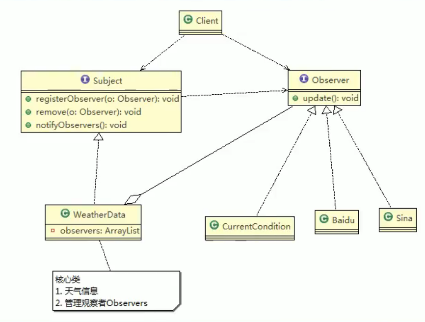

# 18.观察者模式

对象之间**多对一依赖**的一种设计模式，被依赖的对象为Subject为1，依赖的对象为Observer为n，Subject通知Observer变化。

## 优缺点

好处：

1. 观察者模式设计后，会以集合的方式来管理用户（Observer），包括注册，移除和通知。
2. 增加观察者就不需要去修改核心类WeatherData，遵守了ocp原则。

## JDK中应用

JDK Observer类

Observable的作用和地位等价于Subject，Observable是类，不是接口，类中已经实现了核心的方法，即管理Observer的方法add,delete,notify...Observer的作用和地位等价于Observer,有update