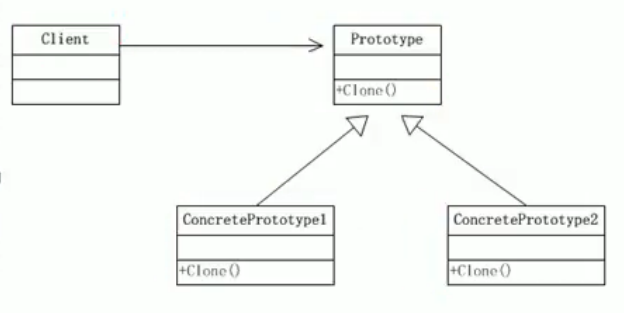

# 5.原型模式

Java中Object类时所有类的根类，Object类提供了一个clone()方法，该方法可以将一个java对象复制一份，但是需要实现clone的Java类必须要实现一个接口Cloneable，该接口表示该类能够复制且具有复制的能力=>原型模式

基本介绍：

1. 原型模式指：用原型实例指定创建对象的种类，并且通过拷贝这些原型，创建新的对象。
2. 原型模式是一种创建型设计模式，允许一个队象再创建另一个可定制的对象，无需知道如果创建的细节。
3. 工作原理是：通过将一个原型对象传给那个要发动创建的对象，这个要发动创建的对象通过请求原型对象拷贝它们自己来实施创建，即对象.clone()

1，Prototype：原型类，声明一个克隆自己的接口

2，ConcretePrototype:具体的原型类，实现一个克隆自己的操作

3，Client：让一个原型对象克隆自己，从而创建一个新的对象（属性一样）

原型模式的缺点：需要给每一个类配备一个克隆方法，这对全新的类不是很难，但对已有的类进行改造时，需要修改其源码，违背了ocp原则。

## 在Spring框架中的使用

Spring中原型bean的创建，就是原型模式的应用。scope可以是singleton以及prototype。

## 浅拷贝问题

1. 对于数据类型是基本数据类型的成员变量，浅拷贝会直接进行值传递，就是将该属性值复制一份给新的对象。
2. 对于数据类型是引用数据类型的成员变量，比如说成员变量是某个数组、某个类的对象等，浅拷贝会进行引用传递。即将该成员变量的引用值（内存地址）复制一份给新的对象。实际上两个对象的该成员变量都指向同一个实例。此时，在一个对象中修改该成员变量会影响到另一个对象的该成员变量值。
3. 浅拷贝是使用默认的clone()方法来实现。sheep=(Sheep)super.clone()

## 深拷贝

1. 复制对象的所有基本数据类型的成员变量值
2. 为所有引用数据类型的成员变量申请存储空间，并复制每个引用数据类型成员变量所引用的对象，直到该对象可达的所有对象。也就是对象进行深拷贝要对整个对象进行拷贝。
3. 深拷贝实现方式1：重写clone方法来实现深拷贝
4. 深拷贝实现方式2：通过对象序列化实现深拷贝

