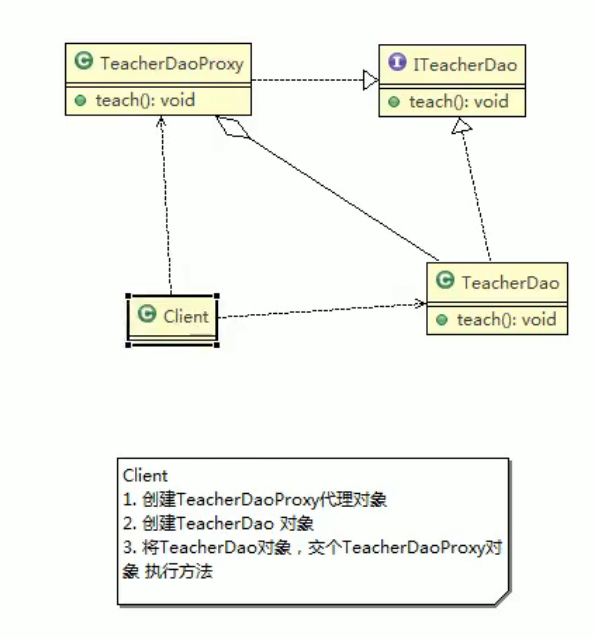
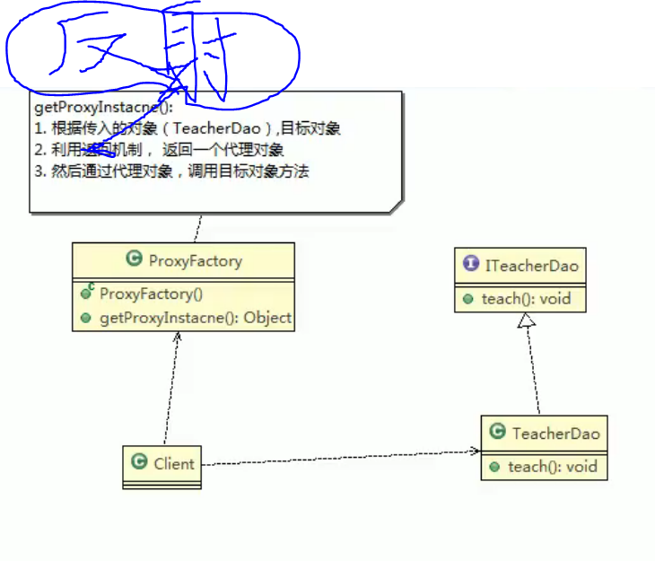
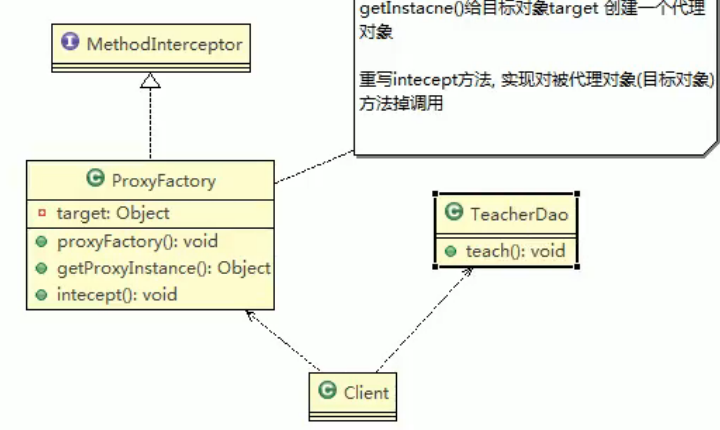

# 13.代理模式

代理模式：为对象**提供一个替身**，以控制对这个对象的访问。即通过代理对象访问目标对象。这么做好处在于，可以在目标对象实现的基础上，增强额外的功能操作，即扩展目标对象的功能。

被代理对象可以是**远程对象**，**创建开销大的对象**，或**需要安全控制的对象**。

代理模式有不同的形式，主要是**静态代理**、**动态代理（JDk代理、接口代理）**和**Cglib代理（可以在内存动态的创建对象，而不需要实现接口，属于动态代理范畴）**。

# 静态代理

静态代理在使用时，需要定义接口或者父类，被代理对象（即目标对象）与代理对象一起实现相同的接口或者是继承相同的父类。

特别提醒：代理对象与目标对象要实现相同的接口，然后通过调用相同的方法来调用目标对象的方法。

静态代理优缺点：

1. 优点：在不修改目标对象的功能前提下，能通过代理对象对目标功能扩展。
2. 缺点：因为代理对象需要与目标对象实现一样的接口，所以会有很多代理类
3. 一旦接口增加方法，目标对象与代理对象都要维护。

# 动态代理

基本介绍：

1. 代理对象，不需要实现接口，但是目标对象要实现接口，否则不能使用动态代理
2. 代理对象的生成，是利用JDK的API，动态的在内存中构建代理对象
3. 动态代理也叫做JDK代理、接口代理

JDK中生成代理对象的API

1. 代理类所在的包：java.lang.reflect.Proxy
2. JDK实现代理只需要使用newProxyInstance方法，但是该方法需要接收三个参数，完整的写法是:static Object newProxyInstance(ClassLoader loader,Class<?>[]  interfaces,InvocationHandler h)

# Cglib代理

基本介绍：

1. 静态代理和JDK代理模式都要求目标对象时实现一个接口，但是有时候目标对象只是一个单独的对象，并没有实现任何的接口，这个时候可使用目标对象子类来实现代理，这就是Cglib代理。
2. Cglib代理也叫做子类代理，时在内存中构建一个子类对象从而实现对目标对象功能扩展，Cglib代理也可归为动态代理
3. Cglib是一个强大的高性能代码生成包，可以在运行期扩展java类与实现java接口，广泛的被许多AOP框架使用，例如Spring AOP，实现方法拦截。
4. 在AOP编程中选择代理模式：1，目标对象需要实现接口，用JDK代理。2，目标对象不需要实现接口，用Cglib代理。
5. Cglib包的底层是通过使用字节码处理框架ASM来转换字节码并生成新的类。

实现步骤：

1. 引入cglib的jar包
2. 在内存中动态构建子类，注意代理的类不能为final，否则报错。
3. 目标对象的方法如果为final static，那么就不会被拦截，即不会执行目标对象额外的业务方法。

