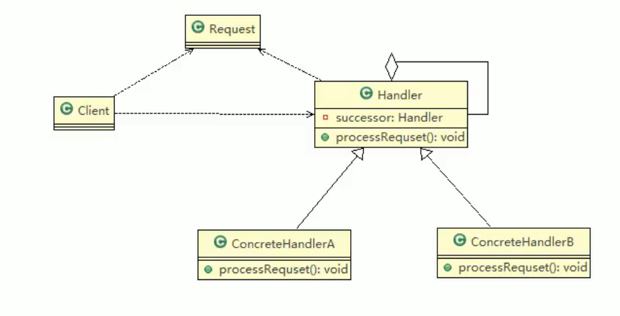
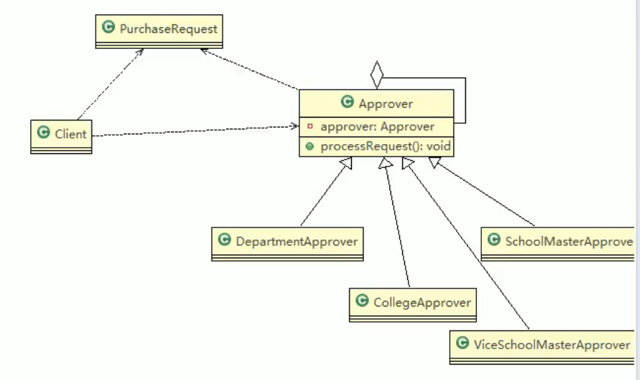

# 24.职责链模式

基本介绍：

1. 职责链模式又叫责任链模式，为请求创建一个接收者对象的链。这种模式对请求的发送者和接收者进行解耦。
2. 职责链模式通常每个接收者都包含对另一个接收者的引用。如果一个对象不能处理该请求，那么会把相同的请求传给下一个接收者，以此类推。
3. 属于行为型模式。

角色及职责：

1. Handler：抽象的处理者，定义了一个处理请求的接口，同时含有另外Handler
2. ConcreteHandlerA,B 是具体的处理者，处理自己负责的请求，可以访问其后继者（即下一个处理者），如果可以处理当前请求则处理，否则就交给后继者去处理，从而形成一个职责链。
3. Request，表示一个请求。

在springMVC中有应用。

## 注意事项和细节

1. 将请求和处理分开，实现解耦，提高系统的灵活性
2. 简化对象，使对象不需要知道链的结构。
3. 性能会受到影响，特别是在链比较长的时候，因此需要控制链中最大节点数量，一般通过Handler中设置一个最大节点数量，在setNext()方法中判断是否已经超过阈值，超过则不允许该链建立，避免出现超长链无意识地破坏系统性能。
4. 调试不方便，采用了类似递归地方法，调试时逻辑比较复杂。
5. 最佳应用场景：有多个对象可以处理同一个请求时，比如：多级请求、请假 / 加薪等审批流程、Java Web中Tomcat对Encoding地处理、拦截器。