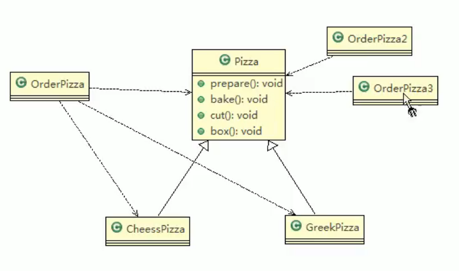
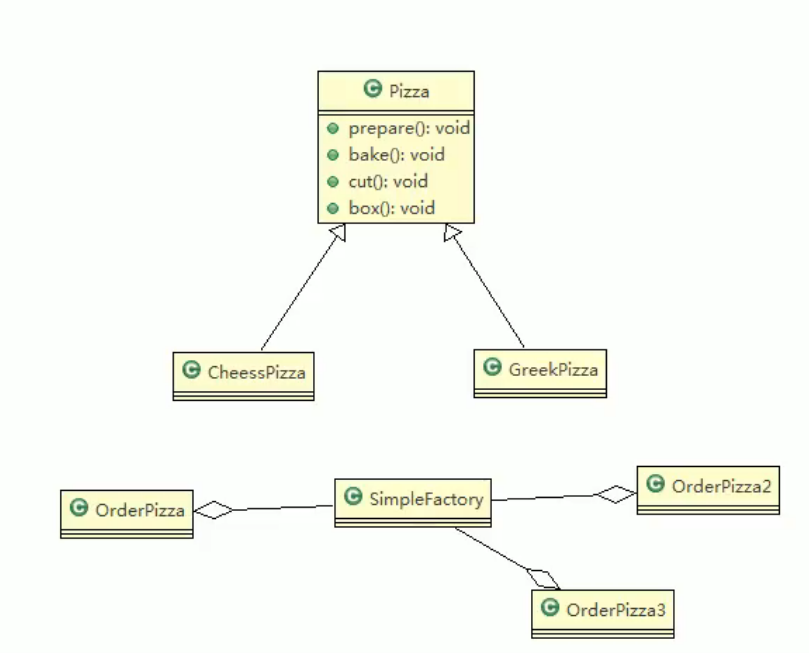
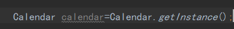
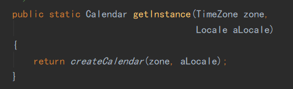
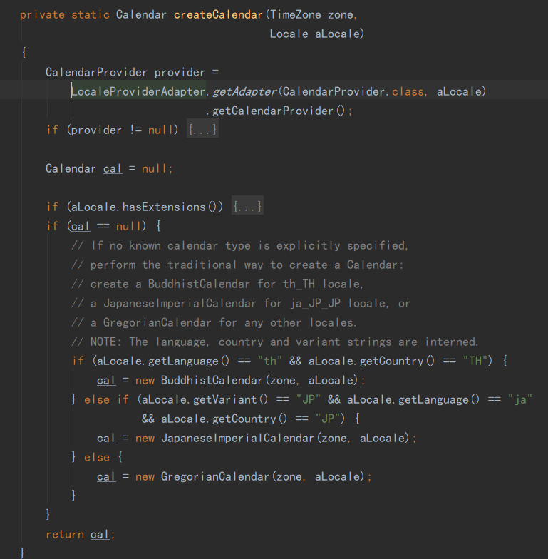

# 2.简单工厂模式

对于披萨店订披萨问题，传统方式在新增披萨时需要大范围进行改动代码违背ocp原则，改进思路：把创建披萨对象封装到一个类中，这样有新的披萨种类时，只需要修改该类即可，其他创建披萨对象的代码不需要修改->简单工厂模式。

基本介绍：

1. 简单工厂模式属于创建型模式，是工厂模式的一种。**简单工厂模式是由一个工厂对象决定创建出哪一种产品类的实例**。简单工厂模式是工厂模式家族中最简单实用的模式。
2. 简单工厂模式：定义了一个创建对象的类，由这个类来**封装实例化对象的行为**。
3. 在软件开发中，当会用到大量的创建某种、某类或者某批对象时，就会用到工厂模式。

在新增Pizza种类时，只需增加SimpleFactory的代码。其中SimpleFactory需提供生成实例的方法。

简单工厂模式也叫静态工厂模式。 因为SimpleFactory提供实例的方法可以写为静态方法，此时OrderPizza在使用SimpleFactory时不需要有SimpleFactory的成员，而直接使用SimpleFactory类的静态方法，写法更为简单，但是灵活性会下降，因为有时可能会需要根据情况来设置不同的SimpleFactory。

## JDK源码分析

JDK中的Calendar类，就使用了简单工厂模式

