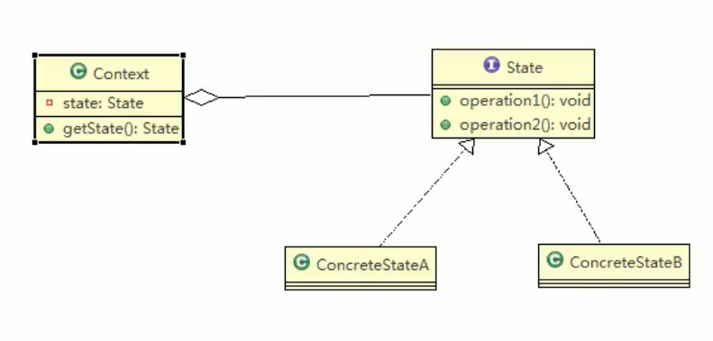
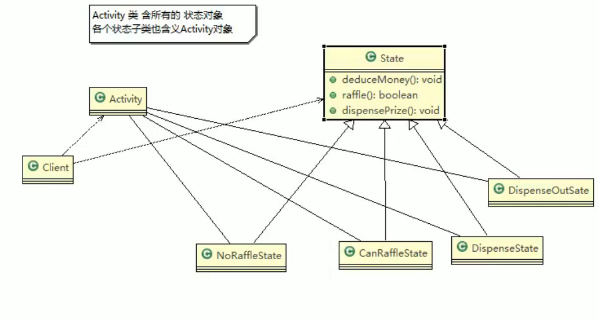

# 22.状态模式

基本介绍：

1. 状态模式主要用来解决对象在多种状态转换时需要对外输出不同的行为的问题。状态和行为时一一对应的，状态之间可以相互转换
2. 当一个对象的内在状态改变时，运行改变其行为，这个对象看起来像是改变了其类。

角色及职责：

1. Context类为环境角色，用于维护State实例，这里实例定义当前状态。
2. State是抽象状态角色，定义一个接口封装与Context的一个特点接口相关行为。
3. ConcreteState具体的状态角色，每个子类实现一个与Context的一个状态相关行为。

## 注意事项和细节

1. 代码具有很强的可读性，状态模式将每个状态的行为封装到对应的一个类中
2. 方便维护
3. 符合开闭原则，容易增删状态
4. 会产生很多类，每个状态都有一个对应的类，当状态过多时会产生很多类，加大维护难度
5. **应用场景**：当一个事件或者对象有很多种状态，状态之间会相互转换，对不同的状态要求有不同的行为时，可以考虑使用状态模式。

