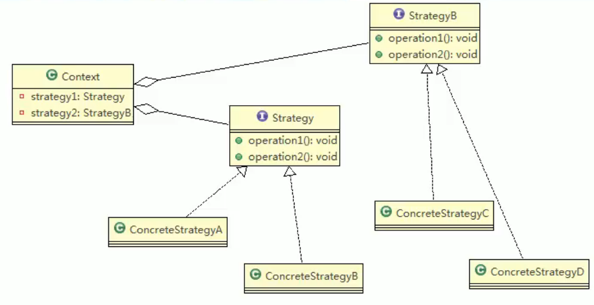
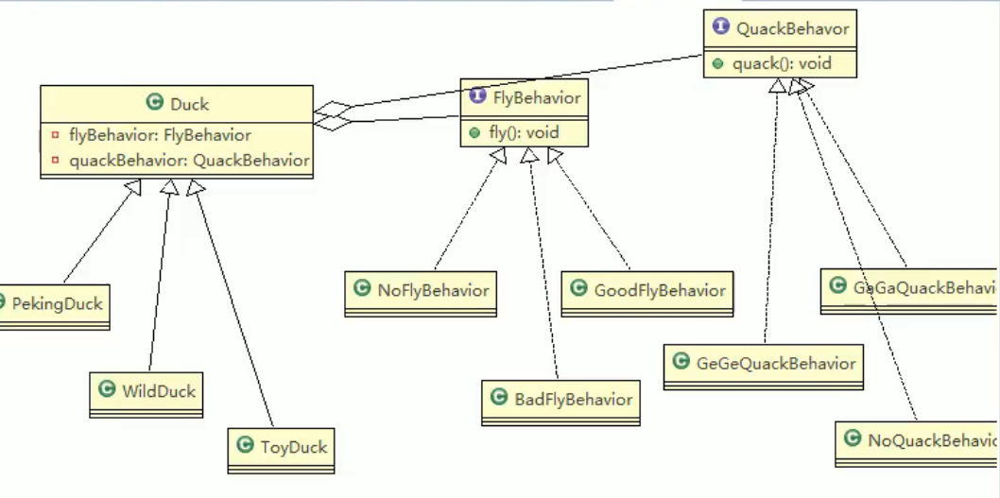

# 23.策略模式

策略模式中定义算法族，分别封装起来，让其之间可以互相替换，此模式让算法的变化独立于使用算法的客户。

体现了几个设计原则，第一、把变化的代码从不变的代码中分离出来；第二、针对接口编程而不是具体类（定义了策略接口）；第三、多用组合 / 聚合，少用继承（客户通过组合方式使用策略）。

## 在JDK Arrays中的应用

## 注意事项和细节

策略模式的关键时分析项目中变化部分与不变部分。

策略模式的核心思想是：多用组合 / 聚合 少用继承；用行为类组合，而不是行为的继承。更有弹性。体现了对修改关闭，对扩展开放。

需要注意的是，每添加一个策略就要增加一个类，当策略过多会导致类数目庞大。