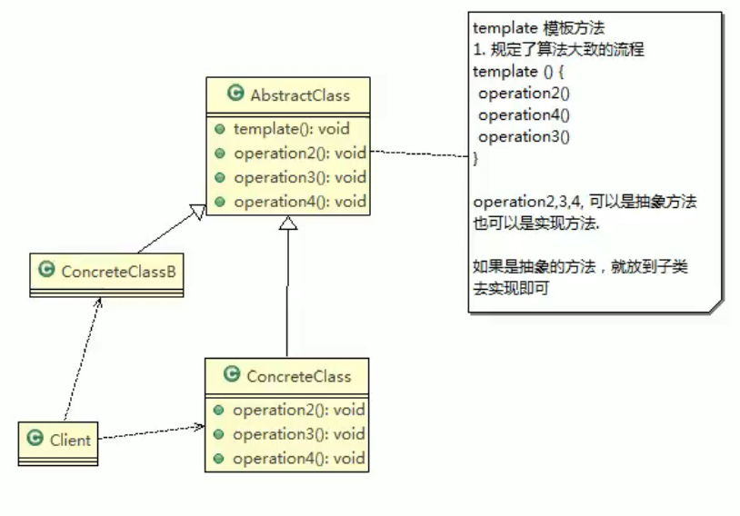
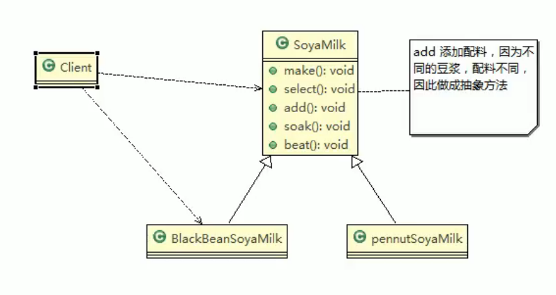

# 14.模板方法

模板方法，在一个抽象类公开定义了执行它的方法的模板，它的子类可以按需要重写方法实现，单调用将以抽象类中定义的方式进行。

简单说，**模板方法模式**定义一个操作中的算法骨架，将一些步骤延迟到子类中，使得子类可以不改变一个算法的结构，就可以重定义该算法的某些特定步骤。

这种类型的设计模式属于行为型模式。

**AbstractClass**抽象类，类中实现了模板方法，定义了算法骨架，具体子类需要去实现其他的抽象方法。

**ConcreteClass**实现抽象方法

## 模板方法模式的钩子方法

在模板方法的父类中，可以定义一个方法，默认不做任何事，子类可以视情况要不要覆盖它，该方法称为钩子。

## Spring中的应用

