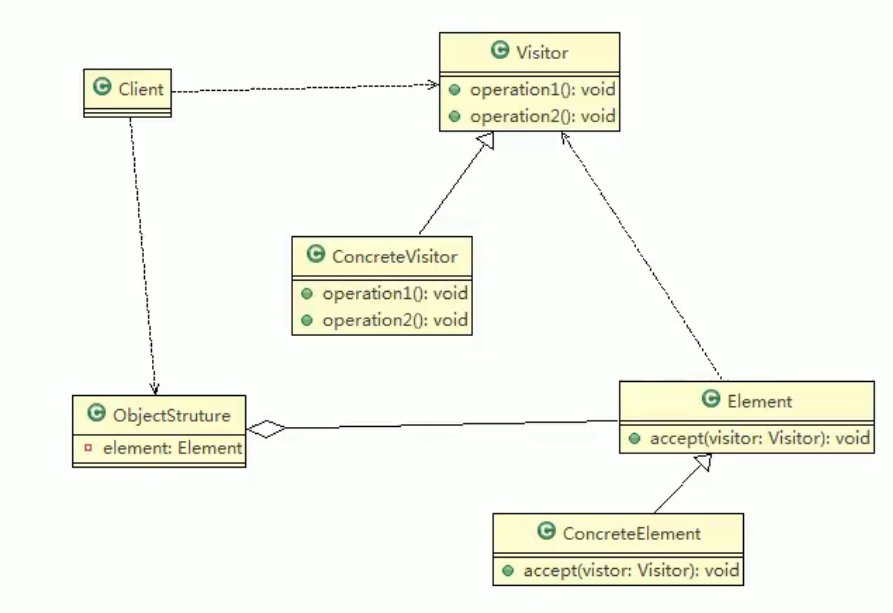
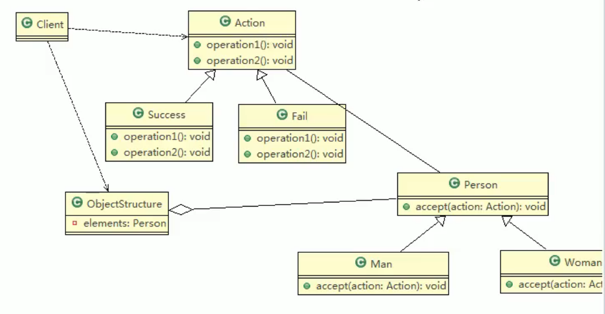

# 16.访问者模式

封装一些作用于某种数据结构的各元素的操作，可以在不改变数据结构的前提下定义作用于这些元素的新的操作。主要将**数据结构**与**数据操作**分离，解决数据结构和操作耦合性问题。访问者模式的**基本工作原理是**：在被访问的类里面加一个对外提供接待访问者的接口。

**访问者模式主要的应用场景是**：需要对一个对象结构中的对象进行很多不同操作（这些操作彼此没有关联），同时需要避免让这些操作污染这些对象的类，可以用访问者模式解决。

角色：

1. Visitor是抽象访问者，为该对象结构中的ConcreteElement的每一个类声明一个visit操作
2. ConcreteVisitor:是一个具体的访问值实现每个有Visitor声明的操作，是每个操作实现的部分。
3. ObjectStructure能枚举它的元素，可以提供一个高层的接口，用来允许访问者访问元素。
4. Element定义一个accept方法，接收一个访问者对象
5. ConcreteElement为具体元素，实现了accept方法。

其中使用了双分派。假设要添加一个Wait状态类，由于使用了双分派，只需要Wait类即可。

## 注意事项和细节

优点：

1. 访问者模式符合单一职责原则、让程序具有优秀的扩展性、灵活性非常高。
2. 适用于数据结构相对稳定的系统。

缺点：

1. 具体元素对访问者公布细节，即访问者关注了其他类的内部细节，这是迪米特法则所不建议的，这样造成了具体元素变更比较困难。
2. 违背了依赖倒转原则，访问者依赖的是具体元素，而不是抽象元素
3. 如果一个系统有比较稳定的数据结构，又有经常变化的功能需求，那么访问者模式就是比较合适的。

