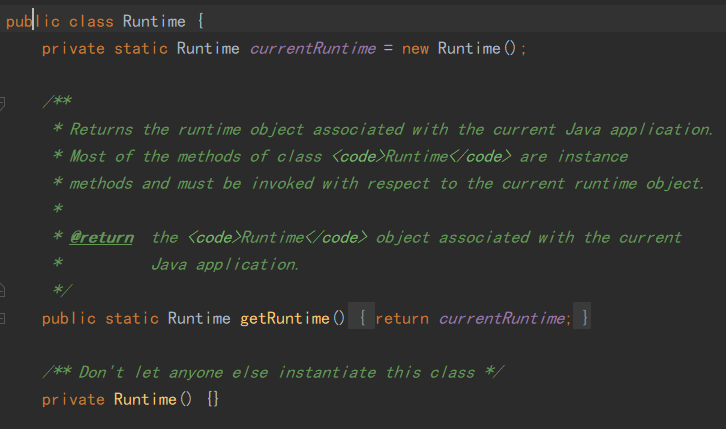

# 1.单例模式

单例模式，就是采取一定的方法保证在整个的软件系统中，对某个类**只能存在一个对象实例**，并且该类只提供一个取得其对象实例的方法（静态方法）。

单例模式有八种方式：

1. 饿汉式（静态常量）
2. 饿汉式（静态代码块）
3. 懒汉式（线程不安全）
4. 懒汉式（线程安全，同步方法）
5. 懒汉式（线程安全，同步代码块）
6. 双重检查
7. 静态内部类
8. 枚举

## 饿汉式（静态常量）

优点：写法简单，在类装载时就完成实例化，避免了线程同步问题

缺点：在类装载时就完成实例化，没有达到Lasy Loading的效果，如果从始至终从未使用过这个实例，则会造成内存的浪费

结论：这种单例模式可用，可能造成内存浪费

## 饿汉式（静态代码块）

优缺点：和上面的方式类似，只是将类实例化的过程放在了静态代码块中，同样也是在类加载的时候就执行静态代码块中的代码，初始化类的实例。

结论：这种单例模式可用，可能造成内存浪费

## 懒汉式（线程不安全）

优点：实现了Lazy Loading的效果，但是只能在单线程下使用

缺点：如果在多线程下，一个线程进入了if(sington==null)判断语句块，还未来得及往下执行，另一个线程也通过了这个判断语句，便会产生多个实例。所以在多线程环境下不可使用这种方式

结论：在实际开发中，不要使用这种方式

## 懒汉式（线程安全，同步方法）

优点：解决了线程不安全问题

缺点：效率太低，每个线程在执行getInstance()方法都要进行同步，这个方法只执行一次实例化代码就够了，后面的想获得该类实例，直接return，方法进行同步效率太低。

结论：在实际开发中，不推荐使用该方式

## 懒汉式（线程安全，同步代码块）

优缺点：该方式本意是对第四种实现方式的改进，因为第四种的同步方法效率太低，改为同步产生实例化的代码块。**但是这种同步并不能起到线程同步的作用**。假如一个线程进入了if(singleton==null)判断语句块，还未来得及往下执行，另一个线程也通过了这个判断语句，这时便会产生多个实例。

结论：在实际开发中，不能使用这种方式。

## 双重检查

优点：双重检查进行了两次if(instance==null)检查，这样就可以保证线程安全了。实例代码只用执行一次。线程安全，延迟加载，效率较高。

结论：在实际开发中，**推荐使用**这种单例设计模式。

## 静态内部类

静态内部类特点，当外部类被装载时，静态内部类并不会立即被装载。同时在静态内部类进行加载时，也能保证线程安全。

优点：这种方式采用了类加载机制来保证初始化实例时只有一个线程。静态内部类方式在SIngleTon类被加载时并不会立即实例化，而是在需要实例化时调用getInstance方法才会装载SingleyonInstance类，从而完成Singleton的实例化。类的静态属性只会在第一次加载类时初始化，JVM帮助保证了线程的安全性，在类进行初始化时，别的线程是无法进入的。避免了线程不安全，利用静态内部类实现延迟加载，效率高。

结论：**推荐使用**。

## 枚举

优点：借助JDK1.5中添加的枚举来实现单例模式。不仅能避免多线程同步问题，而且还能防止反序列化重新创建新的对象。这种方式是Effective Java作者提倡的。

结论：**推荐使用**。

## JDK中的应用

JDK中 java.lang.Runtime就是经典的单例模式

## 注意事项

1. 单例模式保证了系统内存中该类只存在一个对象，节省了系统资源，对于一些需要频繁创建销毁的队象，使用单例模式可以提高系统性能。
2. 当想实例化一个单例的时候，必须要记住使用相应的获取对象的方法，而不是使用new。
3. 单例模式的使用场景：需要频繁的进行创建和销毁的对象、创建对象时耗时过多或耗费资源过多但又经常用到的对象、工具类对象、频繁访问数据库或文件的对象（比如数据源、session工厂等）。